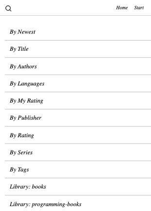

# OPDS Proxy

OPDS Proxy provides a minimal web interface over XML-based OPDS feeds. 
Your eReader likely does not support OPDS, but it does have a rudimentary web browser. 
By running your own OPDS Proxy you can allow eReaders to navigate and download books from your library and any OPDS feed without installing custom eReader software.

<p align="center">
    
</p>

## Features
- Minimal web interface that works on any web browser
- Multiple OPDS feeds
- Automatically converts your `.epub` files into the proprietary format your eReader requires.
    - Kobo: `*.epub` to `*.kepub` (see [benefits](https://www.reddit.com/r/kobo/comments/vz3nx6/kepub_vs_epub/))
    - Kindle:  `*.epub` to `*.mobi`
    - Other: `*.epub`
- Allows accessing HTTP basic auth OPDS feeds from primitive eReader browsers that don't natively support basic auth. 

## Getting Started
1. Download the latest release binary or pull the latest docker image.
2. Configure your OPDS Proxy settings via config file / environment variables.
3. Start `opds-proxy`.
3. Navigate your library and download books to your eReader via web interface.

### Configuration Format

Most settings are defined in a `config.yml`. 

```yml
# Optional port to listen on (default 8080)
port: 5228
# Optional Cookie Encryption Keys
# If these keys aren't set, they are automatically re-generated and logged on startup.
# When new keys are generated all existing cookies are no longer valid. 
# You can generate new keys by running `opds-proxy -generate-keys` and then copy them to your config.
auth:
  hash_key: [32 bit hash key]
  block_key: [32 bit block key]
# List of feed selections presented in the UI
feeds:
  - name: Some Feed
    url: http://some-feed.com/opds
    # Optional Credentials
    # If present, users will not be prompted for credentials in the web interface.
    # The server will take care of sending these with requests to the feed URL.
    # This is useful if you want to make all feeds public or provide a single authentication
    # layer in front of OPDS Proxy without having users remember multiple logins for individual feeds.
    username: user
    password: password
  - name: Some Other feed
    url: http://some-other-feed.com/opds
```

Some config options can be set via command flags. These take precedence over the config file.

```shell
# To set the port via flags
opds-proxy -port 5228

# To generate new cookie keys and exit
opds-proxy -generate-keys

# To use a config file that isn't named `config.yml` in the current path
opds-proxy -config ~/.config/opds-proxy-config.yml 
```


## Motivation
KOReader is great and I've been running it for years on my jailbroken Kindle and Kobo eReaders.
To me, the standout feature is its ability to speak OPDS which allows myself / family / friends to have access to my library from anywhere.
That being said, the Kindle / Kobo native reader software is faster, better looking, has a lower learning curve, and doesn't require a complicated installation process that oftens breaks on device updates.

## My Setup
- All books are stored and managed via Calibre (Docker) in standard `.epub` format.
- Calibre's OPDS feed is turned on but not exposed to the outside world.
- OPDS Proxy is pointed to the Calibre OPDS feed.
- eReaders access OPDS Proxy via web browser. Book files are automatically converted to device-specific proprietary format on download.

### Why Not Use An Existing Solution?
- Calibre
  - Good for metadata management but not for the web interface.
  - Doesn't support Kobo `.kepub` files natively without installing multiple plugins.
  - HTTP basic auth doesn't work on eReader web browsers.
  - Requires converting and storing eReader specific proprietary formats.
  To me, `.epub` is the [master](https://mixbutton.com/mastering-articles/what-is-the-master-recording/) from which all other copies should be derived.
- Calibre-Web
  - Takes over your entire library and makes it no longer compatible to be managed via Calibre.
  - Dated interface
  - Does too much
  - No automatic conversions
- COPS
  - No longer maintained
  - Dated interface
  - No automatic conversions
- send.djazz.se/
  - Requires uploading private content to unknown server
  - Only supports 1 book at a time
  - Doesn't connect to your existing library 
  - Single User
    - Can't share library with friends / family
